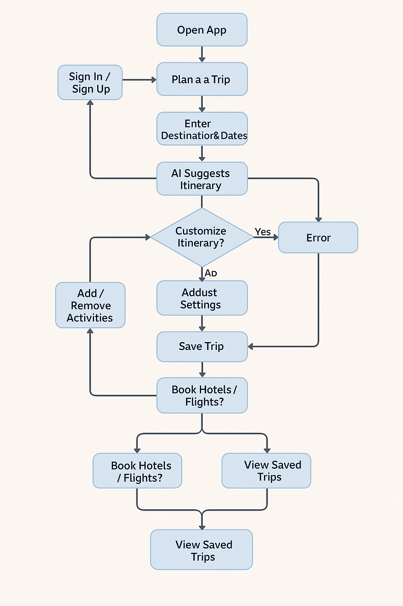
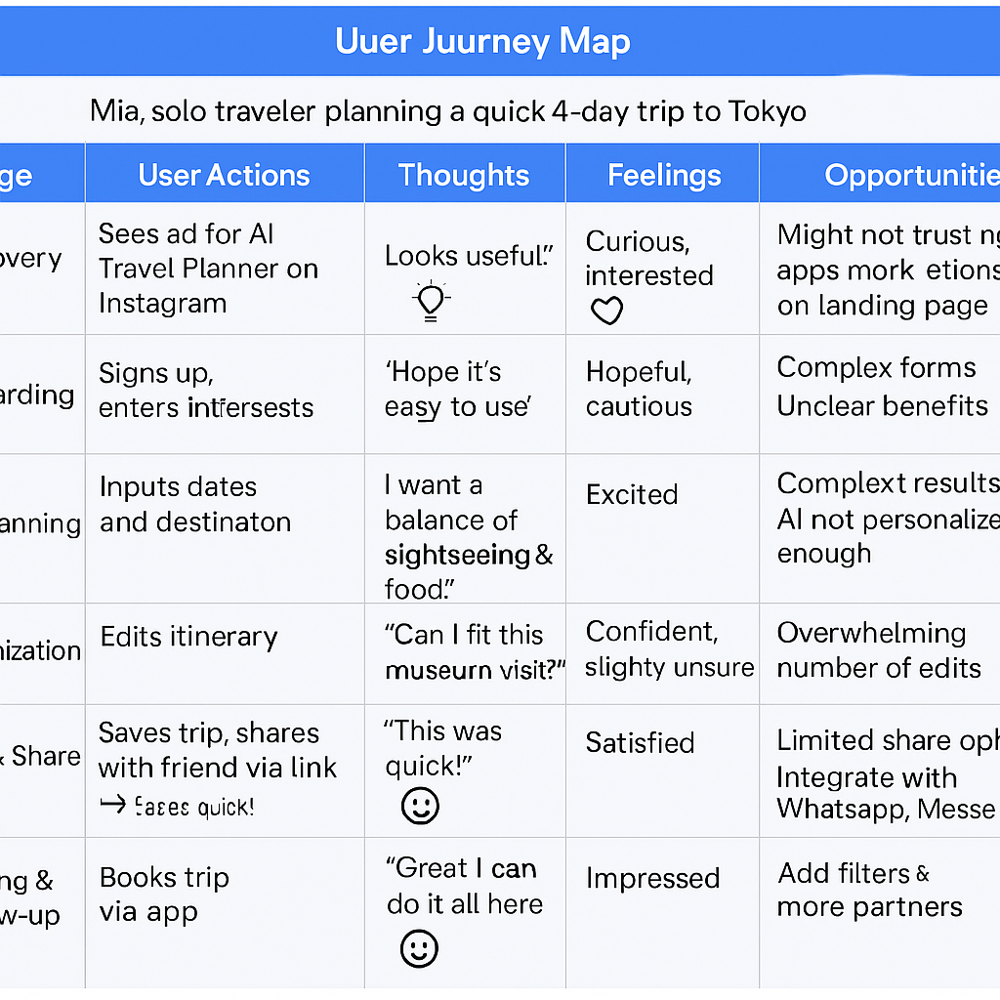
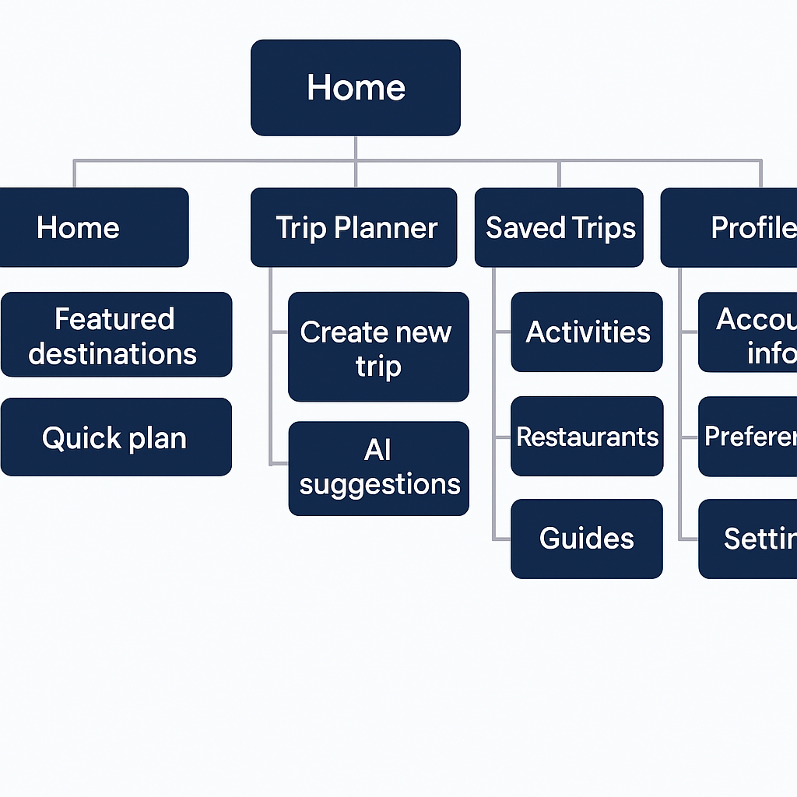

# # AI-Powered Travel Planner – UX Mini Task

This repository contains the deliverables for the UX mini task focused on mapping out the user experience for an AI-Powered Travel Planner.

---

## 1. User Flow
A step-by-step flowchart showing how users navigate through the app.

---

## 2. User Journey Map
A detailed experience map illustrating a persona's journey, highlighting emotions, pain points, and opportunities.

---

## 3. Information Architecture
A visual diagram showcasing the content structure and navigation flow of the application.

---

Designed and prepared for submission as part of UX coursework.
